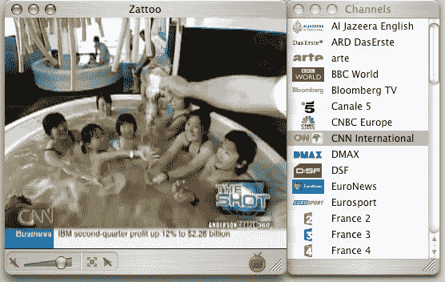

# Zattoo 是当今最好的直播 P2P 电视平台 TechCrunch

> 原文：<https://web.archive.org/web/http://www.techcrunch.com:80/2007/07/18/zattoo-is-the-best-live-p2p-television-platform-available-today/>

# Zattoo 是当今最好的直播 P2P 电视平台

 随着微软通过 Livestation 进入直播 P2P 电视游戏[，人们对这个领域的兴趣越来越大。本月早些时候，我们采访了一些领先的运营商。这份名单上有一家专注于欧洲的公司 Zattoo，其产品目前只在一些欧洲国家有售，而且只有通过邀请才能买到。](https://web.archive.org/web/20221205081123/http://www.beta.techcrunch.com/2007/07/06/microsoft-livestation-slingbox-without-the-box/)

Zattoo 的人很友好，给了我一个 7 天的试用通行证，我已经玩了 24 小时了。我目前的结论是:Zattoo 很棒。

这是 Zattoo 对他们产品的描述；它的每一个部分都是准确的:

> 在 Zattoo 之前，互联网上的电视根本不像电视。视频流跳过、结巴、打散；图像质量很差。Zattoo 把真正的电视放在你的电脑上。我们的革命性技术提供了每个人都在期待的真正的电视质量的视频传输和流畅。

我获得的试用权限是瑞士版本，因此英语频道的数量有限，但频道总数却很大。届时将有至少 30 个直播频道覆盖一系列免费节目，以及大量有线频道，包括 CNN、Al Jazerra、BBC World、彭博、CNBC Europe、France 24 English 和 MTV。

客户端本身很好用；频道列在查看框的右侧。查看窗口可以根据需要调整大小或切换到全屏。

质量是 Zattoo 在该领域脱颖而出的原因。这不是 1080p 高清观看，在 22 英寸的显示器上全屏观看，质量不是很好，但还是可以观看的。虽然从窗口看，图像质量清晰，易于观看。更好的是，图片没有口吃，也没有像素化；它只是简单的工作。我想尽一切办法让它坏掉，下载一个大文件，发微博，下载电子邮件，通过一个 2mb 的有线互联网连接上网冲浪；这幅画从未漏拍一次。我不知道他们是如何做到的，但他们做到了，甚至没有像 Joost 这样的服务能够做到这一点。

该服务目前处于测试阶段，是免费的，计划最终提供免费的基本服务，同时对付费频道收费。广告包括在频道缓冲期间出现不超过几秒钟的预滚动；每个频道都有延迟，但这并不比 Joost 上类似的等待更明显。

只有一件事让我对 Zattoo 感到恼火:他们只给了我 7 天的试用期。如果价格合适，我会付更多的钱。Zattoo 是互联网直播电视的未来，就我目前所见，我怎么推荐都不为过。是的:他们也提供 Mac 版本。

