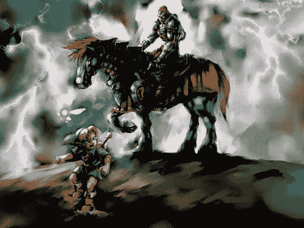

# 塞尔达:时代的陶笛被 Edge 杂志 TechCrunch 评为“有史以来最好的游戏”

> 原文：<https://web.archive.org/web/http://techcrunch.com/2007/07/02/zelda-ocarina-of-time-named-best-game-of-all-time-by-edge-magazine/>

# 塞尔达:时代的陶笛被 Edge 杂志评为“有史以来最好的游戏”

Edge 杂志将*塞尔达传说:时间之笛*评为有史以来最好的游戏。是的，每个人都讨厌这些所谓的“最佳”名单，其中许多只是作为当今 Digg 的诱饵而创建的，但在我看来，Edge 杂志不是你典型的电子游戏杂志。它不使用“棒极了”或“超级棒”这样的词来描述和评论游戏，而是使用一种有分寸的专业语气，更像《名利场》或《新乡巴佬》，而不是普通的游戏垃圾。由 Edge 读者、行业“专家”和 Edge 自己的编辑团队编制的前 100 款游戏的完整名单将于明天公布，但前 10 款游戏已经公布。它们是:

1.*塞尔达传说:时间之笛*
2。*生化危机 4*3。*超级马里奥 64*4。*半衰期 2*
5。*超级马里奥世界*

…

6.*塞尔达传说:一个链接到过去*7。*光环:战斗进化*
8。*最终幻想 XII*9。*俄罗斯方块*
10。*超级银河战士*

我甚至不会和*陶笛*争论；我有点惊讶，但我确实很喜欢；*马里奥 64* 对于任何一个前 10 都是给定的；我从来没有玩过*半条命 2* ，所以我不能说；*马里奥世界*让我想起年轻快乐的时候； *LTTP* 我没玩过(抱歉！);*晕*在我看来还可以；对我现在近乎零的耐心来说，FFXII 太他妈复杂了；俄罗斯方块甚至不应该出现在名单上，因为它是一个超越游戏的游戏；而且我从来没玩过什么 *Metroid* 。

总而言之，这是一份非常可靠的清单。让我们看看剩下的是什么样子，边缘。

塞尔达游戏被评为“有史以来最伟大的游戏”