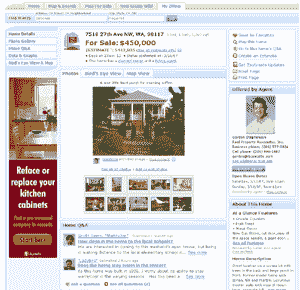

# Zillow Relaunch -增加了自己的问答服务。TechCrunch

> 原文：<https://web.archive.org/web/http://www.techcrunch.com:80/2007/04/03/zillow-back-from-spring-break-with-new-features/>

# zillow Relaunch——增加了自己的问答服务。

[【Zillow】](https://web.archive.org/web/20230113061854/http://www.zillow.com/)今天下午已经下线，作为热门的房地产网站增加了许多新功能。

他们可能已经看到了雅虎问答的巨大成功——其中一个变化是一个名为 Home Q & A 的新产品，它允许用户对 Zillow 数据库中 7000 万个美国家庭中的任何一个提出和回答问题。答案由其他 Zillow 用户评分。

Zillow 数据库中的每个家都有自己的专用页面。现在，任何用户都可以在网站上添加任何住宅及其周边的照片和信息。用户还可以显示房屋是否出售、要价以及其他信息。这是对去年九月增加的[用户生成内容功能的扩展。以前，只有 60 万名声称拥有自己房屋的注册用户或超过 15 万名房地产经纪人可以列出待售房屋或发布房屋照片。现在，任何注册用户都可以列出一个待售房屋，并发布不限数量的房屋照片，尽管列表上的主要房地产仍然是为认证的所有者或代理人保留的。其他用户可以标记不良照片和信息。](https://web.archive.org/web/20230113061854/http://techcrunch.com/2006/09/19/zillow-adds-user-generated-home-information/)

Zillow 超越了他们从经纪公司和家装商店获得的一般网站广告，使注册用户能够为他们的房屋清单开展有针对性的广告活动。新的广告单元被称为“EZ 广告”。用户将能够通过邮政编码来定位他们的活动，并指定他们的广告将获得的浏览量或银行滚动数。这些广告的有效 CPM 将是每印象一分钱。

Zillow 声称，3 月份该网站的独立访客人数为 410 万(康姆斯克(美国)称为 180 万，低于一年前的 230 万，每月页面浏览量为 3300 万)。他们说，90%的游客拥有自己的家，54%的游客在未来两年内购买或出售房屋。该公司已经筹集了 5700 万美元的风险投资。