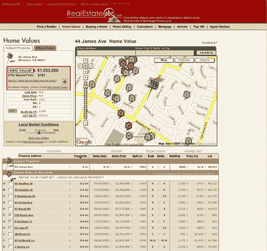

# Zillow 有竞争对手 

> 原文：<https://web.archive.org/web/http://www.techcrunch.com:80/2006/03/29/zillow-has-competition/>

成立仅三个月的 Zillow(T2)公司，根据公开的可比数据，向人们提供特定地区的房屋价值指标，在不久的将来将会面临竞争。

新网站名为[房地产 ABC](https://web.archive.org/web/20221209073118/http://realestateabc.com/) (归[互联网品牌](https://web.archive.org/web/20221209073118/http://www.internetbrands.com/ib/)所有)。

Zillow 的竞争对手正在测试一个隐藏的网址:[www1.realestateabc.com/home-values/](https://web.archive.org/web/20221209073118/http://www1.realestateabc.com/home-values/)。我不知道他们是否会留下它，但现在它是活的。

名字不像 Zillow 那么酷，设计也不像 Zillow 那么流畅，但在某些方面可能会更好。例如，Real Estate ABC 允许用户使用 Ajax 滑块调整特定属性的属性值。可调整的物业因素包括室内、室外、地段、视野、隐私/噪音和当地市场条件。

用户还可以通过直接在结果页面上添加或删除可比数据来优化属性值。事实上，房地产 ABC 提供了可比数据的重要细节，包括离具体地址的距离。房地产 ABC 也提供了与谷歌地图的混搭，尽管他们不像 Zillow 那样使用卫星图像。

Zillow 可能是最近推出的最受欢迎的混搭之一。如果有的话，房地产 ABC 表明，如果一个混搭网站要尝试创建一个真正的企业，他们需要在竞争到来之前建立不容易复制的专有功能。

