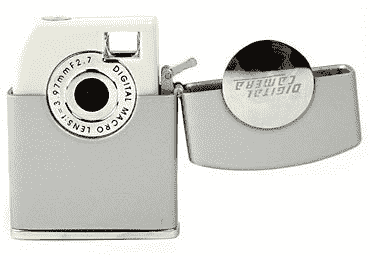

# Zippo 相机打火机

> 原文：<https://web.archive.org/web/http://techcrunch.com/2006/09/14/zippo-camera-lighter/>

当我年轻的时候，我认为 Zippo 是一家只生产最好的打火机的公司的伟大理想。我认为他们高于资本主义，他们只是最好的，你不能碰他们。然后我长大了，开始看迪克西旗 Zippos 和披头士 Zippos(说真的，wtf？).

现在，Zippo 推出了一种新模式，让它更进一步。他们在打火机里放了一个摄像头。这款相机可以容纳 100 张 320×240 的照片，或者 30 张 640×480 的照片，所以你知道它非常棒。它有 64MB 的内置内存，可以通过 USB1.1 连接到你的电脑上。我想如果你还没有一部内置蹩脚相机的手机，并且你真的在寻找一种花费 30 美元的方式，你可以在这里很快做到。

[数码相机打火机](https://web.archive.org/web/20160115185912/http://www.hotgadget.com/store/customer/product.php?productid=16215&cat=0&page=)【hot gadget via[Gadgetizer](https://web.archive.org/web/20160115185912/http://www.gadgetizer.com/2006/09/14/zippo-camera-lighter/)