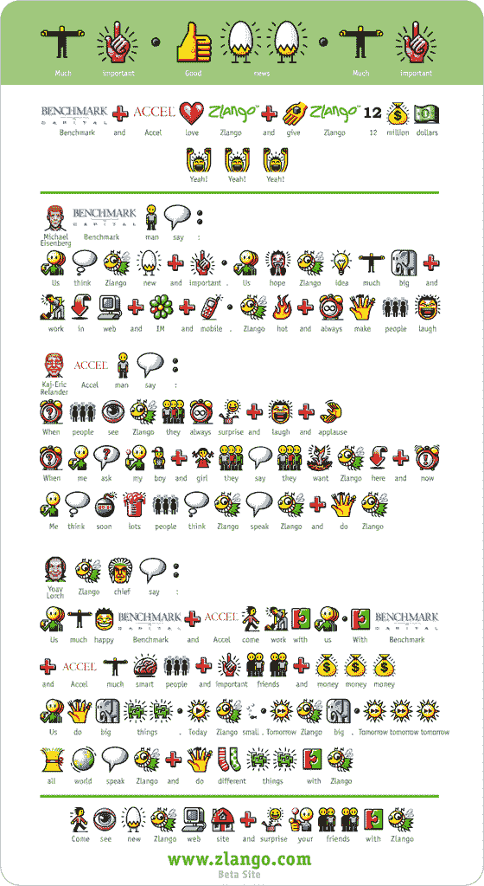

# Zlango 更新:BenchMark 和 Accel 投资 1200 万美元——TechCrunch

> 原文：<https://web.archive.org/web/http://www.techcrunch.com:80/2007/02/11/zlango-update-benchmark-and-accel-invest-12-million/>

# Zlango 更新:BenchMark 和 Accel 投资 1200 万美元

 [https://web.archive.org/web/20220813203607if_/https://www.youtube.com/embed/TlTlYCqOnb4?version=3&rel=1&showsearch=0&showinfo=1&iv_load_policy=1&fs=1&hl=en-US&autohide=2&wmode=transparent](https://web.archive.org/web/20220813203607if_/https://www.youtube.com/embed/TlTlYCqOnb4?version=3&rel=1&showsearch=0&showinfo=1&iv_load_policy=1&fs=1&hl=en-US&autohide=2&wmode=transparent)

视频

总部位于以色列的 [Zlango](https://web.archive.org/web/20220813203607/http://www.zlango.com/) 将于明天宣布一轮 1200 万美元的融资，由 BenchMark Capital 和 Accel Partners 牵头。该公司在 2006 年中期推出了基于图标的短信服务，并已扩展到三个国家(以色列、波兰和某些加勒比手机运营商)。融资的新闻稿(见文章底部)是用 Zlango 语写的，有英文翻译(很好的修饰)。

该公司创造了一种基于图片的全新语言。用户学习这种用图片代替单词和短语的语言，并用它来发送短信。Zlango 是 live，用户可以直接下载或者通过他们的运营商使用该软件。

Zlango 的乐趣并没有随着新闻发布而停止。该公司用 Zlango 制作了一个披头士歌曲 Drive My Car 的音乐视频(嵌入在上面)，你可以在这个页面上[创建](https://web.archive.org/web/20220813203607/http://www.zlango.com/Content.aspx?Page=create)自己的 Zlango 信息，并通过电子邮件发送给朋友，或者嵌入在任何网站上。

当我去年第一次看到 Zlango 的时候，我很喜欢它，因为他们创造了一种新的语言。该公司表示，在未来，用户将能够创建自己的图标供个人使用。然后用户可以开始把这些图标放到 Zlango 社区，在那里他们将被投票并可能被包含到语言中。因此，就像任何其他语言一样，Zlango 将基于使用模式随着时间的推移而发展。

Zlango 现在支持大约 100 种不同的手机。这是新闻稿:

