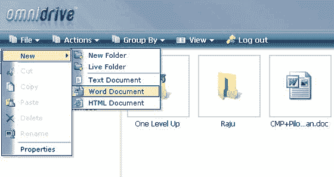
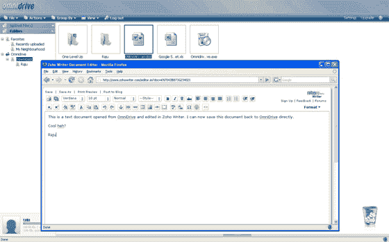

# Zoho，omni drive Office 文档存储合作伙伴 TechCrunch

> 原文：<https://web.archive.org/web/http://www.techcrunch.com:80/2007/01/19/zoho-omnidrive-partner-for-office-document-storage/>

# Zoho，omni drive Office 文档存储合作伙伴

线上办公套件 [Zoho](https://web.archive.org/web/20230220145307/http://www.zoho.com/) 和在线存储公司 [Omnidrive](https://web.archive.org/web/20230220145307/http://www.omnidrive.com/) (见下文披露)今天宣布了一项合作计划，该计划将扩展两家公司的功能。该集成利用了 Zoho 最新更新的 [API](https://web.archive.org/web/20230220145307/http://writer.zoho.com/public/help/zohoapi/fullpage) 。

该合作伙伴关系允许用户将他们所有的 Zoho 办公文档存储在 Omnidrive 中，为他们提供了一个集中的在线文件存储区域。此外，单击 Omnidrive 中的任何办公文档都会自动打开该文档，以便在 Zoho 进行编辑。它还允许用户通过使用 Omnidrive 的共享功能在文档上进行协作。

这种新的合作关系也意味着 Omnidrive 现在可以说提供了一个在桌面和在线上制作和编辑文件的完整链接。Omnidrive 的文件链接使您的桌面或 Zoho Writer 中的更新也能更新/同步其他位置的文件。这种链接是我们之前分析[在线存储服务](https://web.archive.org/web/20230220145307/https://techcrunch.com/2006/01/31/the-online-storage-gang/)时注意到的主要特征。

更多信息请参见 [Omnidrive](https://web.archive.org/web/20230220145307/http://www.omnidrive.com/blog/2007/01/19/071-brings-zoho-lovin/) 和 [Zoho](https://web.archive.org/web/20230220145307/http://blogs.zoho.com/general/omnidrive-becomes-perfect-with-zoho/) 博客。关于这些公司的背景，参见我们之前对 [Zoho](https://web.archive.org/web/20230220145307/https://techcrunch.com/tag/zoho) 和 [Omnidrive](https://web.archive.org/web/20230220145307/https://techcrunch.com/tag/omnidrive) 的报道，在这里参见 Webware 最近对 Omnidrive [的报道](https://web.archive.org/web/20230220145307/http://www.webware.com/8301-1_109-6660636-2.html)。

***披露:**2006 年 12 月，TechCrunch 的创始人迈克尔·阿灵顿投资了 Omnidrive。更多信息参见[关于页面](https://web.archive.org/web/20230220145307/https://techcrunch.com/about-techcrunch/)。*

