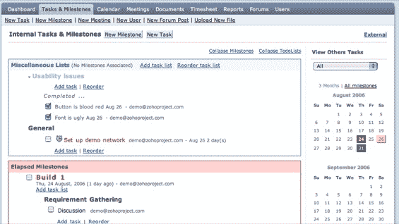

# ZohoProjects 挑战项目管理大本营 TechCrunch

> 原文：<https://web.archive.org/web/http://www.techcrunch.com:80/2006/08/25/zohoprojects-challenges-basecamp-on-project-management/>

# ZohoProjects 挑战项目管理大本营

  AdventNet 的在线生产力套件 [Zoho](https://web.archive.org/web/20221002125402/http://zoho.com/) 在其已经很长的产品列表中增加了一个项目管理系统。ZohoProjects 现在接受新注册，你可以在首页使用一个模拟账户。Zoho 团队告诉我，如果 Basecamp 的目标是“越少越多人”，Zoho 项目将会有丰富的功能。现在还没有，但听起来是个不错的策略。一旦所有的 Zoho 服务(总共有 12 个)都可以单点登录，这将会非常强大。

3 个项目每月 5 美元，无限项目每月 80 美元，ZohoProjects 在价格上低于 BasecampBasecamp 收费 12 美元和 149 美元，用于 3 个或无限个项目。upstart alternative[ActiveCollab](https://web.archive.org/web/20221002125402/http://www.activecollab.com/)是免费的，可以通过许多托管公司为你托管，但与 Basecamp 和 ZohoProjects 不同的是，它的软件需要下载并放在公司以外的服务器上。

ZohoProjects 目前看起来怎么样？有许多突出的功能，包括一个单独任务的时钟和一个日历。待办事项列表可以通过拖放重新排序。有讨论项目的论坛。对标签有一些支持，比 Basecamp 多，比 ActiveCollab 少，但没有我想要的多。可以标记文档，但不能标记任务。我想当这项服务开始被使用时，这种情况将会改变。

ZohoProjects 中也没有 RSS 提要——base camp 有提要，ActiveCollab 没有。有限的权限选项可用，没有内部消息发送-只是直接访问用户的电子邮件。事实上，与个人用户相关的信息非常少；例如，你不能看着一个用户，看他们负责什么。

文件传输和存储限制尚未确定。

该公司表示，它正在对其所有服务的单一登录系统进行最后的修改。希望这将使用 ZohoWriter、ZohoShow 和其他 Zoho 服务创建的文档在 ZohoProjects 中更容易使用。Basecamp 的一大优势是篝火聊天程序。Zoho 有 ZohoChat，它也可以集成到项目管理系统中。

ZohoProjects 的未来发展将包括更广泛的报告以及生成和跟踪账单和发票的能力。

如果该公司能够确定单点登录，并整合一个成功的聊天服务，事情可能真的会有所进展。那么 Zoho 服务在一起会更加强大，而不是感觉像是一系列不同的服务，每个都工作得还可以，但最终是不相连的。ZohoProjects 实际上是将所有服务联系在一起的东西；结合该公司的免费在线文字处理器、演示服务和电子表格制作工具，这是一个相对较低价格的相当强大的软件包。当 Zoho 可以正常使用时，请关注它的博客。

