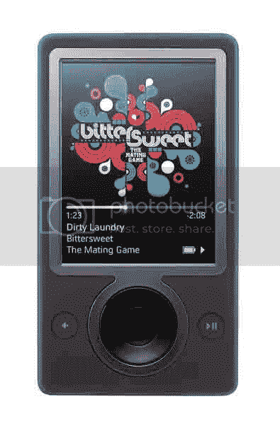

# Zune 获得价格和日期

> 原文：<https://web.archive.org/web/http://techcrunch.com/2006/09/28/zune-gets-price-date/>

微软将 Zune 的发布日期定在 11 月 14 日星期二。备受期待的 DAP 将在全国零售商处以 249.99 美元的价格出售。

如果你在过去几个月一直住在一个洞里，Zune 通过 WiFi 提供音乐共享，扩展了目前可用的 DAPs。这个功能是否足以废黜 iPod 之王，还有待观察。

Zune 的另一个可能的优势是通过 Zune 音乐商店提供无限制的音乐通行证。用户可以支付 14.99 美元的固定费用，并下载无限量的音乐。这与用户必须购买每首歌曲或专辑的 iTunes 计划相反。

微软还最终确定了 Zune 上预装的媒体。你可以在跌落后看到:

**音轨**

*   一群马，“邪恶吉尔”(流行音乐唱片公司)*   苦:甜，《交配游戏》(Quango 音乐组)*   [CSS](https://web.archive.org/web/20210829035326/http://www.audiomonger.com/2006/09/11/cansei-de-ser-sexy-interview/) ，“Alala(微软编辑)”(子流行记录)*   达克尔，《在天空的尽头(编辑)》(Astralwerks)*   一举一动都是一幅画，“生命的迹象”(V2)*   小罪，“留下”(Astralwerks)*   被崇拜者，“告诉我告诉我”(V2)*   拉格斯，“开卷”(V2)*   热气流，“一根盐柱”(流行音乐专辑)

**音乐视频**

*   30 秒到火星，《杀戮》(处女唱片)*   BT，“1.618”(DTS 娱乐)*   乍得范加伦，“红色热滴”(次流行唱片)*   以 Roots Manuva 为特色的 Coldcut，“True Skool”(忍者调)*   CSS，“让我们做爱，听死亡从上面”(子流行唱片)*   果蝠，“活着:吹走我心的风”(流行音乐唱片)*   爷爷，“提升我自己”(V2)*   热芯片，“一遍又一遍”(阿斯特拉沃克斯唱片公司)*   克拉克和斯马克主演德兹。，“让我回家”(Quango 音乐集团)*   金斯基，“现场:斯堪的纳维亚半岛的雪域”(流行音乐唱片)*   保罗·欧肯弗德，《更快杀死小猫咪》(布瑞妮·墨菲主演)(小牛唱片公司)*   瑟琳娜-马内什，《榨干化妆品》(Playlouderecordings)

**电影短片**

*   5 博罗:“一个纽约滑板分钟”(滑板)*   激进电影:《越野——前进》(山地自行车)*   TGRTV The North Face(滑雪/单板滑雪

这里确实有一些不错的东西。

新闻稿