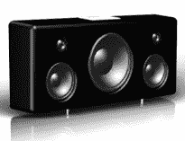

# Zune Hi-Fi 像 Dock 一样到来| TechCrunch

> 原文：<https://web.archive.org/web/http://techcrunch.com/2006/09/28/zune-hi-fi-like-dock-arrives/>

嗯，没多久。

同一天，Zune 的价格点和日期宣布，Zune 配件开始出现。这是澳大利亚 VAF 研究公司制造的奥克塔维奥。它看起来惊人地像 iPod 高保真音响。怎么样？

奥克塔维奥是第一个带有“为 Zune 制造”标志的配件，显然将于“2006 年末”上市虽然还没有价格。

[阿德莱德公司选择 Zune 集团](https://web.archive.org/web/20131208074414/http://australianit.news.com.au/articles/0,7204,20450801%5E15306%5E%5Enbv%5E,00.html)【澳大利亚 IT via [Engadget](https://web.archive.org/web/20131208074414/http://www.engadget.com/2006/09/28/vaf-researchs-octavio-speaker-dock-a-hifi-for-zune/)