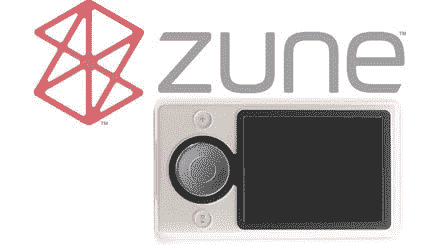

# Zune 传播爱，为“共享”歌曲提供积分 TechCrunch

> 原文：<https://web.archive.org/web/http://www.techcrunch.com:80/2006/10/24/zune-spreads-the-love-offers-credits-for-shared-songs/>

# Zune 传播爱，为“共享”歌曲提供积分

Zune 的神秘越来越浓。我们的 [CrunchGear 的传言者在](https://web.archive.org/web/20221203090857/http://crunchgear.com/2006/10/23/zune-to-pay-you-back-for-sharing-songs/#comments)发现，当你使用 Zune 的[三天/三次播放](https://web.archive.org/web/20221203090857/http://crunchgear.com/2006/10/03/wi-fi-in-zune-hopelessly-crippled-or-fully-featured/)系统通过 Wi-Fi 分享一首歌，而另一方后来在 iZunes 音乐商店(IZMS)购买了这首歌，你就可以获得一个积分，你以后可以用这个积分换取音乐和媒体。非常聪明，微软，非常聪明。

显然，这里的目标是为音乐创造一点病毒式营销，作为额外的奖励，推动 IZMS 上的销售。当我们更仔细地研究 Zune 时，似乎 ms 团队刚刚发现了大多数 MP3 播放器迄今为止一直缺失的 iPod 致命因素，尽管我们仍然对今年传言的[触摸屏 iPod](https://web.archive.org/web/20221203090857/http://crunchgear.com/2006/10/18/touchscreen-ipod-let-the-speculation-continue/)感到相当兴奋。也许 Zune/TouchPod ThunderDome 已经准备好了，Zune 向 iPod 扔猪粪便，而史蒂夫·乔布斯和比尔·盖茨分别扮演主人和爆破手。梅林达可以是姨妈实体。