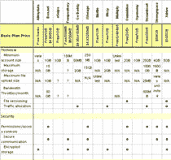

# 在线存储团队——TechCrunch

> 原文：<https://web.archive.org/web/https://techcrunch.com/2006/01/31/the-online-storage-gang/?_ga=2.103476873.806913366.1623689966-1123777744.1623689966>

在线存储市场发展迅速。在过去，用户只能期待一个简单的服务，可以从映射的虚拟驱动器或简单的基于 web 的界面缓慢地上传和下载文件。几乎没有竞争(以及泡沫的破裂)导致极少量存储的价格非常高。

在过去的一年中，一系列新的服务已经推出(有些将在二月份推出)，这些服务具有重要的 web 2.0 特性，合理的价格(包括免费的无限存储空间)，并且至少在一个案例中( [OmniDrive](https://web.archive.org/web/20210614173025/http://www.omnidrive.com/) )，能够在远程服务器上使用 Office 等本地应用程序直接读写文件。最后一项功能跳过了先将文件下载到硬盘的要求，从而大大加快了写入文件的过程。

**在线仓储帮**
我们一共考察了十三家公司。分别是: [AllMyData](https://web.archive.org/web/20210614173025/http://www.allmydata.com/) 、[Box.net](https://web.archive.org/web/20210614173025/http://www.box.net/)、 [eSnips](https://web.archive.org/web/20210614173025/http://www.esnips.com/) 、 [Freepository](https://web.archive.org/web/20210614173025/https://freepository.com/) 、 [GoDaddy](https://web.archive.org/web/20210614173025/https://www.godaddy.com/gdshop/email/vsdb_landing.asp?se=%2B&app%5Fhdr=&ci=2661) 、[historage](https://web.archive.org/web/20210614173025/http://www.iomega.com/na/products/istorage.jsp)、 [Mofile](https://web.archive.org/web/20210614173025/http://www.mofile.com/en/) 、 [Mozy](https://web.archive.org/web/20210614173025/http://www.mozy.com/) 、 [Omnidrive](https://web.archive.org/web/20210614173025/http://www.omnidrive.com/) 、 [Openomy](https://web.archive.org/web/20210614173025/http://www.openomy.com/) 、 [Streamload](https://web.archive.org/web/20210614173025/http://www.streamload.com/)

另一项服务 [Zingee](https://web.archive.org/web/20210614173025/http://www.zingee.com/) 尚未推出，可能也有(也可能没有)吸引人的产品。

在我们为这篇文章调查的 13 家公司中，有三家非常突出。总部位于澳大利亚的 OmniDrive (没有资金支持，但时间不长)在功能上明显领先。Box.net 和细流也是很好的选择。

这些服务大致可以分为以存储为中心和以共享为中心。一些服务，如 Mozy 和不幸命名的 Godaddy，只以存储为中心。GoDaddy 提供在线文件备份，具有非常基本的上传和下载功能，实际上是一个远程网络驱动器。它们是一种基本服务，价格相当诱人(20 美元/年，2 GB)。您在这里找不到共享或其他高级功能。

其他服务提供存储，但真正侧重于共享文件。这里有许多选择，但最好的(OmniDrive、Box.net 和 Streamload)提供完全的私有和公共共享。此外，我非常喜欢 Box.net 处理组文件夹的方式，任何数量的人都可以拥有读/写权限。Omnidrive 也即将推出这项功能。

**Web 2.0 特性**
大部分新玩家(可能除了 Mozy)都激光聚焦于 Web 2.0 的关键特性。最好有多个文件夹(私人的、共享的、群组的、公共的)，每个文件夹都有 RSS 源，等等。包括 Omnidrive 在内的一些公司也构建了允许订阅 RSS 附件(如播客)的功能，这样这些文件就存储在云中，而不是硬盘上。

OmniDrive 有一个无人能及的关键特性:云中文件的完全读/写功能。从 Omnidrive 中打开一个文件，编辑它并将其写回 Omnidrive，而无需下载本地副本。一旦他们发布了 API，我想很多很多服务将会把 Omnidrive 存储服务融合到他们的应用程序中。这实在是太有说服力了。

AllMyData 在该组中独一无二，是一个完整的点对点解决方案，具有“网格存储”。这意味着你为其他用户放弃了硬盘上的存储空间，而你得到了他们的回报。抛开放弃存储正是用户在寻找解决方案时不想要的这一事实不谈，其他人的计算机必须通电并联机才能访问您的文件这一事实是一个严重的服务限制。

**定价**
定价无处不在，尽管我预计随着竞争将这些公司中的一些赶出市场，定价将会稳定下来。

Streamload 在定价上最具竞争力，向每个用户提供 25 GB 的免费空间。

在我看来，推销这些产品最明显的方法就是大胆地以象征性的价格提供无限的存储空间。成本可以通过一次性注册费用和下载带宽收费来支付(一旦我需要这些文件，我愿意付费获取)。

我坚信，在线存储应该、也将会与像 Windows 这样的新计算机和应用程序打包在一起。硬盘上未受保护但非常重要的媒体内容(音乐、电影、家庭电影、图片)的数量每天都在增长。人们需要一个合理收费的地方来备份这些数据，在我看来，戴尔和其他公司应该将这项服务与 PC 打包在一起。所有初始软件将自动存储，用户可以选择不断同步他们的硬盘驱动器与虚拟驱动器。

虽然这项业务利润微薄，但这是每年数十亿美元的收入机会。

**图表**
 上面的信息只是突出显示了链接到左侧的[表中更详细的信息。](https://web.archive.org/web/20210614173025/http://www.flickr.com/photo_zoom.gne?id=93730415&size=o)

我们无法与每家公司直接对话，网站上的信息通常不完整或很难找到。因此，随着更多更好的数据的到来，我们将更新这个表格。此外，我确信我已经忽略了这个领域的许多竞争对手，所以我也会更新公司列表。

关于完整的特性对照表，[参见此处](https://web.archive.org/web/20210614173025/http://www.flickr.com/photo_zoom.gne?id=93730415&size=o)。

Adam Bouskila 的研究为这篇文章所做的研究是由居住在加拿大温哥华的 17 岁天才 Adam Bouskila 进行的。我对 Adam 的辛勤工作感激不尽，我希望在未来的职位上与他再次合作。

更新:从评论和电子邮件中我清楚地看到，这个领域正在爆炸，我错过了许多公司和功能。我也没有意识到弗雷德·威尔逊在去年 12 月发表了关于这个主题的文章，但他在这里有一篇很棒的文章。